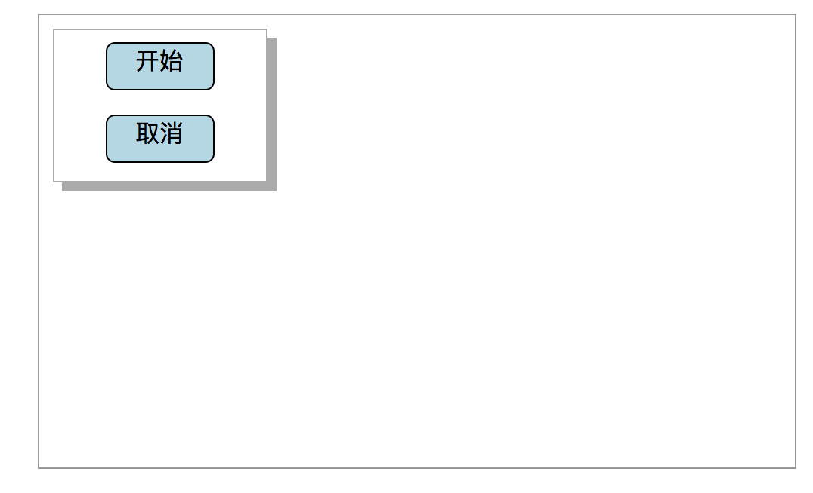
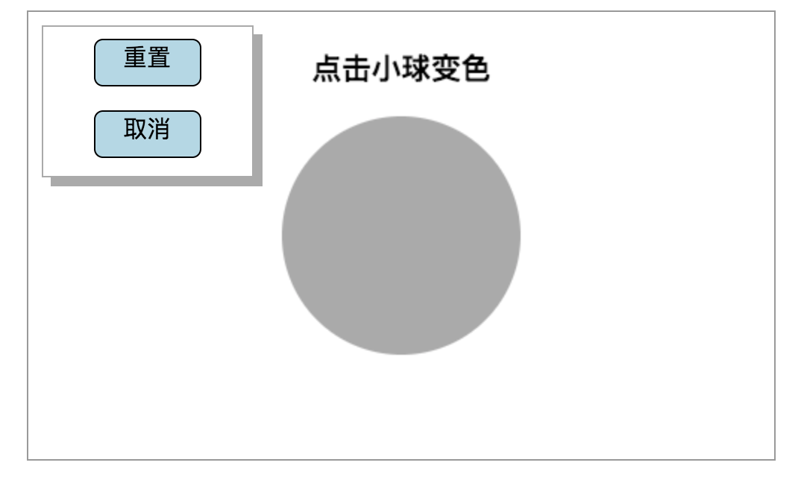

# canvas交互——div和isPointInPath()

和canvas的交互这里介绍两种方法：
## context.isPointInPath(x,y) 

这个方法是判断你给定的坐标是否在context绘制的路径下，是返回true，否返回false.

这个方法对于fillRect和strokeRect绘制出来的图形返回都是false.
我的理解是要检测的图形范围需要调用了stroke()或fill()。
所以，用rect画方形再stroke()或fill()是可以正确判断的。

```  
   let flag = context.isPointInPath(e.clientX - canvas.getBoundingClientRect().left,
            e.clientY - canvas.getBoundingClientRect().top);

```   
这句话获取当前鼠标位置，判断是否在绘制图形内.  


##div
这个方法是通过点击div中的内容出发click等相关事件，来控制canvas相关操作  

其实重点就在于如何如何讲div浮于canvas之上，思路其实很简单。  
思路：  
1.让包裹canvas和div的div，positon是relative
2.让浮窗div positon是absolute，再给个定位就可以了

```  
<div id="container">
    <canvas id="canvas" width="500" height="300"></canvas>
    <div id="pane">
        <a id="star" class="btn">开始</a>
        <a id="cancel" class="btn">取消</a>
    </div>
</div>

<style>
    #container {
        position: relative;
        width: 500px;
        height: 300px;
    }
    #pane {
        top: 10px;
        left: 10px;
        position: absolute;
        width: 140px;
        height: 100px;
    }
```  


为了展示这两个交互的效果我做了一个demo

点击开始会绘制出一个圆，点击圆内侧可以使小球变色。



代码在code/others/changeColor.html