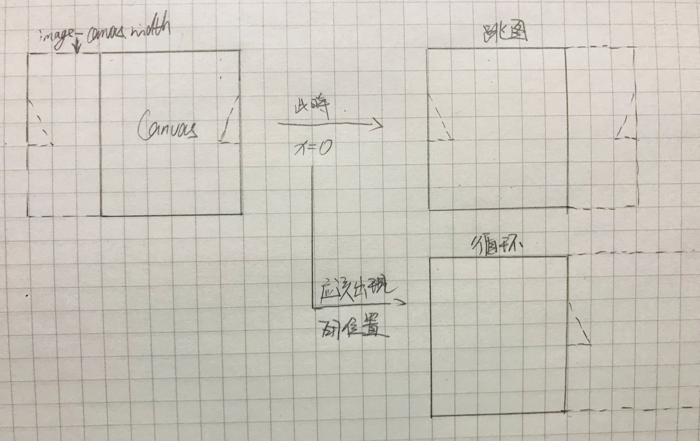
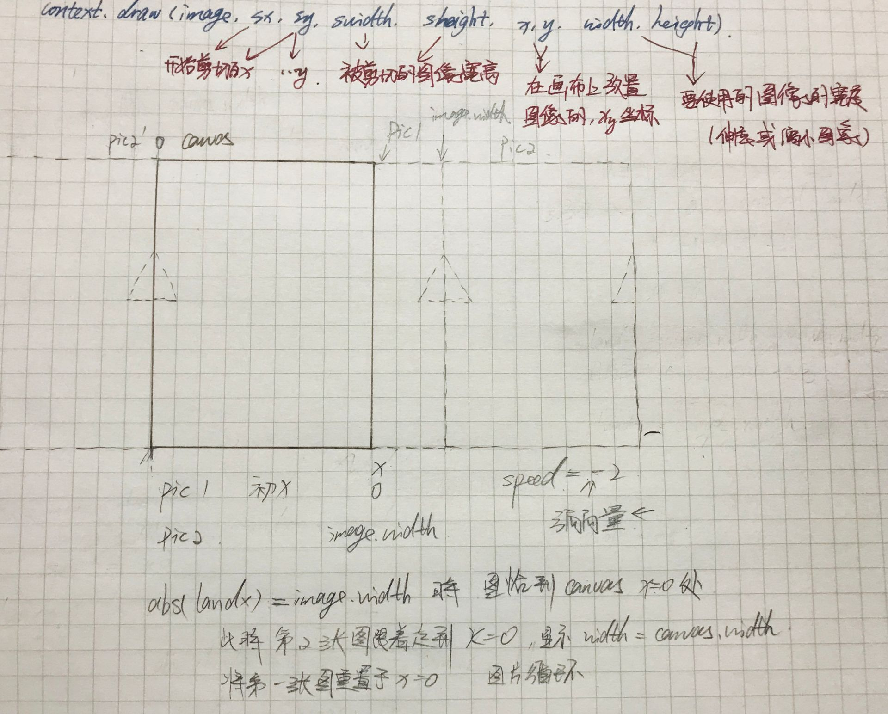

# 背景图片循环  

在跟慕课视频FlappyBird小游戏时，有这样一个问题：   
陆地在循环过程中会忽然一跳，效果保存到视频中，如果有兴趣可以看一下。
当时老师说时因为图片前后接不上，我仔细看了一下是可以对上的。
判断的代码如下：

```
export class Land extends Sprite {
    constructor() {
        const image = Sprite.getImage('land');
        super(image, 0, 0,
            image.width, image.height,
            0, DataStore.getInstance().canvas.height - image.height,
            image.width, image.height);
        this.landX = 0;//地板的水平变化坐标
        this.landSpeed = Director.getInstance().moveSpeed;//地板的移动速度
    }

    draw() {

        this.landX = this.landX + this.landSpeed;
        if (this.landX > (this.img.width - DataStore.getInstance().canvas.width)) {
            this.landX = 0
        }
        super.draw(this.img, this.srcX, this.srcY, this.srcW, this.srcH,
            -this.landX, this.y, this.width, this.height)
    }
}
```   
重要的判读是这句：this.landX > (this.img.width - DataStore.getInstance().canvas.width)，如果当前的x值大于图片的宽度减去canvas的宽度，就将x放到0的地方  

看似没错，但是这样判断，放到任何一张图片都是会有一跳的效果，原因是，判断这个位置的时候，背景图还在canvas内，下一张图出现的位置就不应该是0，而应该是在canvas.width地方   

为了说明这个问题，我画了张图：  
   

## 解决方案

绘制两张图，在第一张图移出屏幕时，第二张图的canvas.width长度处于canvas中，此时将第一张图片的x设置到0的位置上就可以衔接上   
   

看矩形部分就行了，其他都是分析时写的。  

### 方案一
思路：改变图片的放置位置，也就是修改context.drawImage的第六个参数。

``` 
	let speed=-2;
	
    function drawImg(width = 0) {

        context.save()
        context.drawImage(image, 0, 0, image.width, image.height,
            (width !== 0) ? (width + landX) : landX, canvas.height - image.height, image.width, image.height);
        context.restore()
    }


   function run() {

        window.requestAnimationFrame(() => run());
        landX = Math.abs(landX) <image.width ? landX + speed : 0;

        drawImg();
        drawImg(image.width - 2)//第二张图，这个地方减不减看具体图片情况
    }
```  
此处的speed我给的是方向向量，向左，所以是负值。  
也可以直接使用speed为正值，后面的判断和放置加符号，看自己喜好。  
第二张图理论上是要紧接着第一张图的循环的，如果有间断可以减一些值微调，具体代码见code/canvas/index-move-land.html  

### 方案二 
思路：不改变图片的裁剪位置，使用translate改变图片x轴位置。 

```
    function drawImg() {
        
        skyOffset = Math.abs(skyOffset) < sky.width ? skyOffset + speed : 0;

        context.save();
        context.translate(skyOffset, 0);
        context.drawImage(sky, 0, 0);
        context.drawImage(sky, sky.width - 2, 0)
        context.restore();
    }

```  

具体代码见code/canvas/index-move-sky.html 

