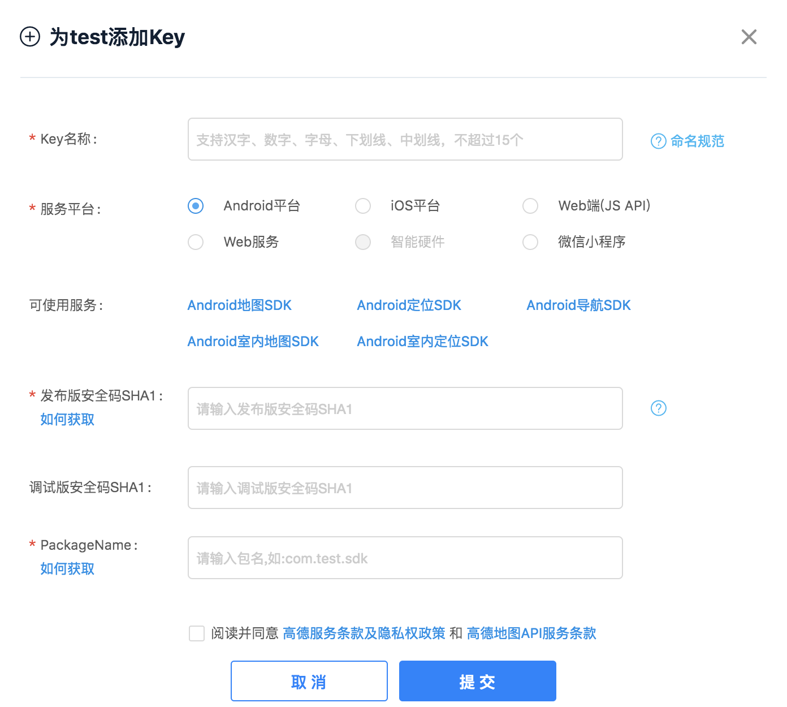
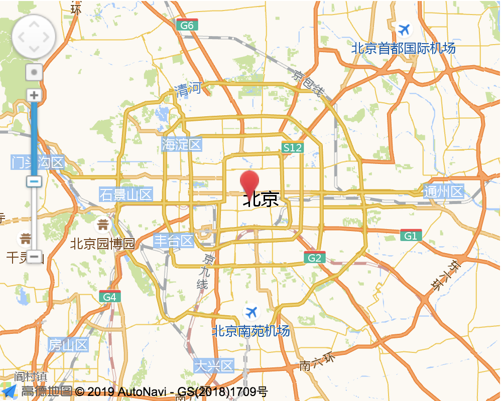

#简单易用的地图插件  

推荐高德开放平台 
 
<a href="https://lbs.amap.com/api/javascript-api/guide/abc/prepare">
https://lbs.amap.com/api/javascript-api/guide/abc/prepare</a>
##注册
一共四步，按照步骤填写就可以了  

##获取key  
使用高德地图需要key，一个app用于不同平台需要申请不同的key

控制台->应用管理->我的应用
点击➕先创建一个项目，此时没有key生成，需要在点右上角的➕添加食用平台才会有key产生   



##简单页面中使用  

1.引入js

``` 
<script type="text/javascript" src="https://webapi.amap.com/maps?v=1.4.12&key=您申请的key值"></script> 
``` 
2.添加div标签作为地图容器，同时为该div指定id属性. 

```
<div id="container"></div> 
```

3.为地图容器指定高度、宽度；

```
#container {width:300px; height: 180px; }  
```
4.进行移动端开发时，请在head内添加viewport设置，以达到最佳的绘制性能； 
<meta name="viewport" content="initial-scale=1.0, user-scalable=no">  

5.加载api 

``` 
window.onLoad  = function(){
        var map = new AMap.Map('container');
  }
  var url = 'https://webapi.amap.com/maps?v=1.4.12&key=您申请的key值&callback=onLoad';
  var jsapi = doc.createElement('script');
  jsapi.charset = 'utf-8';
  jsapi.src = url;
  document.head.appendChild(jsapi);
```   
*以上均为文档内容

使用jsonp形势请求接口数据，请求结束触发回调函数  


##其他

如果需要其他控件，气泡，拉杆等，可在左侧地图控件中寻找，具体属性请点击：<a href="https://lbs.amap.com/api/javascript-api/reference/map-control">查看更多属性和方法</a>

效果：
  

非常简单的demo，见code/js/gdMap.html