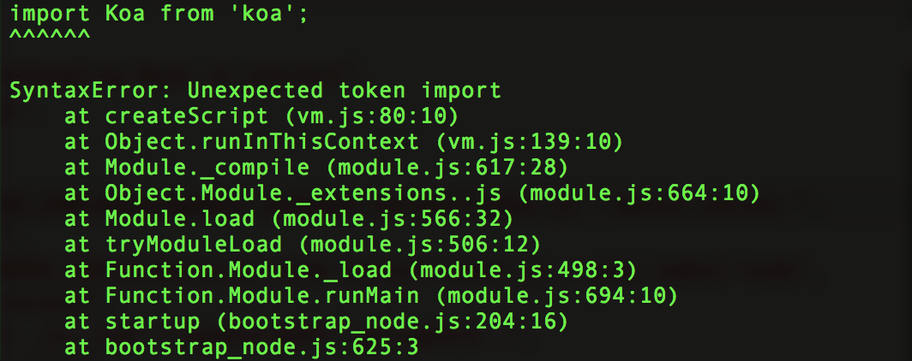

#在vue/nuxt.js项目中使用使用import

以nuxt.js脚手架npx create-nuxt-app 创建的项目为例
他的package.json文件中的启动项dev和start的命令如下项如下

```
  "scripts": {
    "dev": "cross-env NODE_ENV=development nodemon server/index.js --watch server",
    "start": "cross-env NODE_ENV=production node server/index.js"
  }
```  
自带的node启动方式node和nodemon无法识别import关键字，所以，项目运行会报错. 

 

## 使用babel

###1.安装babel-preset-es2015
```
npm install babel-preset-es2015

```  

###2.在babel配置文件中配置
在.babelrc中加入es2015支持

```
{
  "presets": ["es2015"]
}

```   

###3.修改package.json   
添加 --exec babel-node

```
  "scripts": {
    "dev": "cross-env NODE_ENV=development nodemon server/index.js --watch server  --exec babel-node",
    "start": "cross-env NODE_ENV=production node server/index.js --exec babel-node"
    }
```