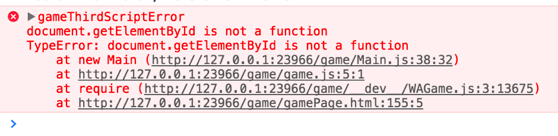
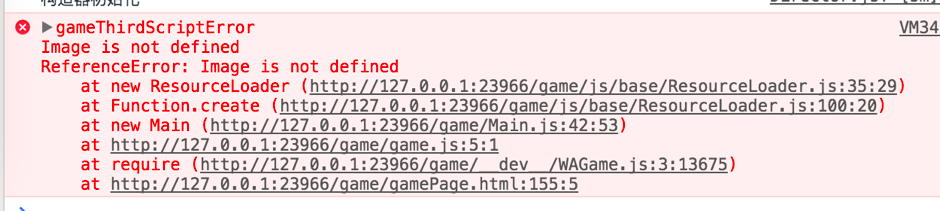
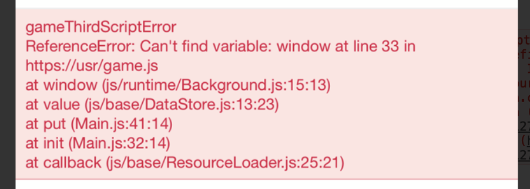
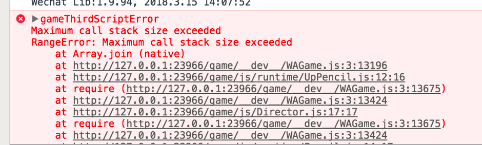

# 在浏览器中开发微信小游戏

## 可转换api
### 获取canvas  
微信：wx.createCanvas（）  

浏览器：  

1.先创建一个index.html文件.  

2.其中使用canvas标签,宽高写成微信canvas的宽高。
  
此处的宽高，可以通过，在微信开发者工具中获取：  
	
```
console.log(canvas.width, canvas.height)
```
	
3.使用document.getElementById('canvas')获取  

### 创建图片  
微信：wx.createImage()  

浏览器：new Image()

### 事件监听  

以touchStart事件为例 
 
微信：wx.onTouchStart(function callback) 

浏览器：canvas.addEventListener('touchstart',function(){})  

## 注意事项 
### 必须配置文件   
将game.js、game.json、project.config.json三个文件拷出放入项目中即可，其他文件夹可自行创建。  
game.js是程序入口文件

### 启动项目 
可以使用live-server或者node-server等在文件夹下起项目，有的cavnas api必须要在网络环境下，最好使用。

### 使用es6语法
如果使用export，import语法报错，可以将script的type设置成module

```
<script type="module" src="game.js"></script>
```   
### 引用文件后找不到 
在浏览器中import文件必须要加后缀.js，微信开发者工具中不需要

```
import {Main} from "./Main.js";
```
不要使用大写JS结尾，不然会报XX.JS.js找不到


## 项目转移时的报错 
### document.getElementById is not a function
 
解决方法：  
document.getElementById('canvas')改为wx.createCanvas  

### Image is not defined
  
解决方法：  
将new Image()换成wx.createImage();   

### can't find variable:window  

   
解决方法：  
微信里没有window，如果需要取window.innerWidth一类的属性，可以直接选取canva的属性，canvas.width

### Maximum call stack size exceeded
超过最大调用堆栈大小
  

如果代码中有外部引用的属性，可以尝试改为内部引用
 