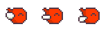

#精灵类的切换 

精灵类一般是一系列的动作在一张图片上，如下图：



想要小鸟动起来，就需要记录每一个小鸟的位置，来进行轮流显示。
比如上图的小鸟的宽为：34px ，高为：24px，左右边距为：9px，上下边距为：10px；

小鸟的显示需要记录4个数值， 左，上，宽，高。

```  
   let birdWidth = 34;
    let birdHeight = 24;
    let leftRight = 9;
    let topBottom = 10;
    
    birds = [
        {left: leftRight, top: topBottom, width: birdWidth, height: birdHeight},
        {left: leftRight + birdWidth + 2 * leftRight, top: topBottom, width: birdWidth, height: birdHeight},
        {left: image.width - leftRight - birdWidth, top: topBottom, width: birdWidth, height: birdHeight}
    ];
```   

接下来就是如何让小鸟轮流动起来  
我之前犯的错误是，在一个requestAnimationFrame中循环，而正确的逻辑是在不同的requestAnimationFrame中循环。

```
    function run() {
        window.requestAnimationFrame(() => run());
 
            drawImg(birds[place]);
            place < birds.length - 1 ? place++ : place = 0;

    }

```   

这样写完，小鸟会很快速的切换，因为 requestAnimationFrame这个函数的间隔并不是一定的，此时要控制动画桢，我用的方法是记录当前的时间，将上次时间和此次之间相减的时间相加，超过60就切换下一个位置。

```
    let place = 0,
        lastTime = (new Date).getTime(), total = 0;
    
    function run() {
        window.requestAnimationFrame(() => run());
        let now = (new Date).getTime();
        total = total + (now - lastTime);
        if (total >= 60) {
            drawImg(birds[place]);
            place < birds.length - 1 ? place++ : place = 0;
            total = 0;
        }
        lastTime = now;
    }
```  

具体代码见code/canvas/sprite-birds.html